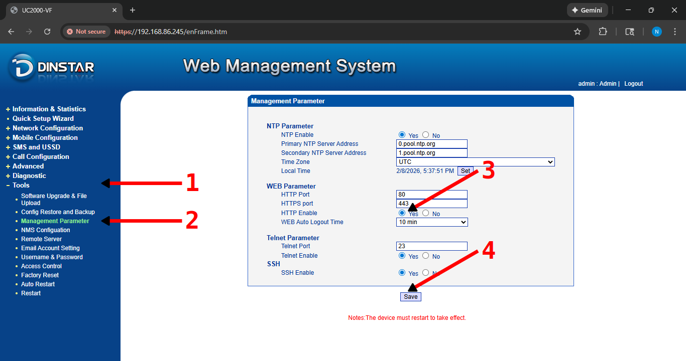
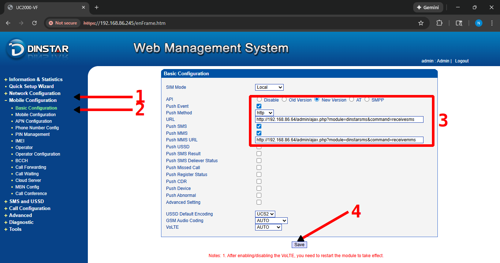

# oazmi-apps/dinstar-freepbx-sms-router

A [_FreePBX_](https://www.freepbx.org/) addon/module that opens a two-way `sms` and `mms` message routing with a
[_Dinstar_](https://www.dinstar.com/) GSM Gateway, over http.

## setup instructions

### build instructions

to build the module package, simply create a tarball of all the `.php` files and the `module.xml` file,
by running the 7zip shell command below:

> 7z a -ttar "./dist/dinstarsms.tar" "./*.php" "./module.xml"

(if you have `deno` installed, you alternatively execute `deno task build`)

and now, the module's tarball will be placed under the `./dist/` folder.

### module installation

- to install this module, open up your freepbx admin web portal and log in.
- on the navigation bar at the top, click on `Admin > Module Admin`.
- make sure that you are in the `Module Updates` tab (which opens up by default right now, but may not in the future).
- click on the `Update modules` button at the top of the configuration page.
- select `Upload (From Hard Disk)` in the `Type` field.
- then, click on the `Choose File` button, and select the `./dist/dinstarsms.tar` file that you previously built.
- now hit the `Upload (From Hard Disk)` button, and then head back to the `Module Updates` tab of the `Admin > Module Admin` page.
- find the name of this module (`SMS Router Module for Dinstar`), expand the entry by clicking on it,
  and then click on the `Install` button on the `Action` field.
- scroll all the way up and then click on the `Process` button at the top right of the page, then hit `Confirm`.
- finally, at the top right of the page, you will see a new `Apply Config` orange button show up.
  click on it for the extension to apply its settings and work.

### gateway configuration

- to permit outbound sms from your freepbx module to your sim gateway, you will need to enable its http api like so:
  > 
- to forward inbound sms from your gateway to this freepbx module, you will configure http push events for sms like so:
  > 
  - the `PUSH SMS URL` (which is incorrectly specified as just the `URL` in the settings page)
    will have to be set to the following template, based on what your freepbx's ip-address/hostname is:
    > http://{FREEPBX_DOMAIN}/admin/ajax.php?module=dinstarsms&command=receivesms

### fixing dropped inbound messages

when you have multiple contacts/devices registered to a single extension number,
only the devices that are immediately online (by asterisk's standards) will receive the message.
all other, temporarily offline or sleeping devices, will miss the message.

the only reliable way to reduce the chances of this happening (without involving some complex solution, such as google/apple push-notifications),
is my decreasing the `Keep Alive Interval` in freepbx. to do so, simply:

- log into your freepbx admin portal and navigate to `Settings > Asterisk SIP Settings`.
- open up the `SIP Settings [chap_pjsip]` tab.
- search for the `Keep Alive Interval` settings, and change the value from the default `90` seconds to `30`, or `20`.

## development

to get LSP suggestions, you'll need to clone the [`core`](https://github.com/FreePBX/core) freepbx repo,
and the [`framework`](https://github.com/FreePBX/framework), then place them in the parent folder to this repo.

> git clone "https://github.com/FreePBX/core.git" "../freepbx-core/"
>
> git clone "https://github.com/FreePBX/framework.git" "../freepbx-framework/"

## version

0.1.3
